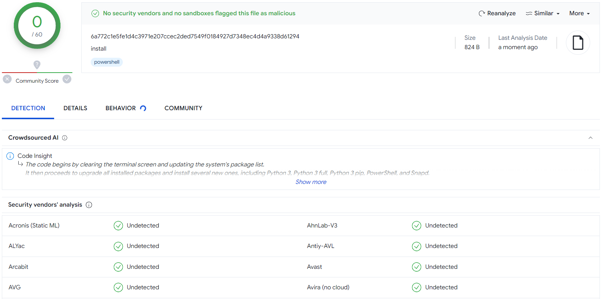
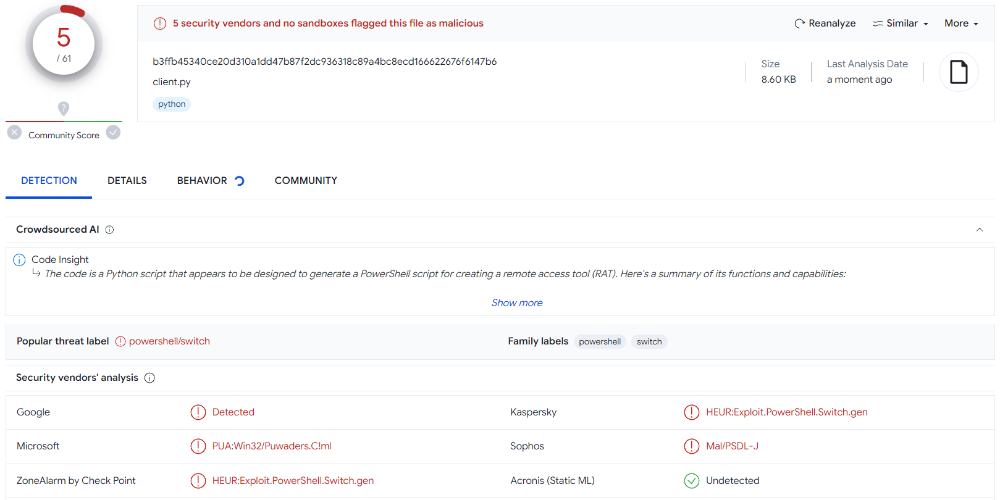
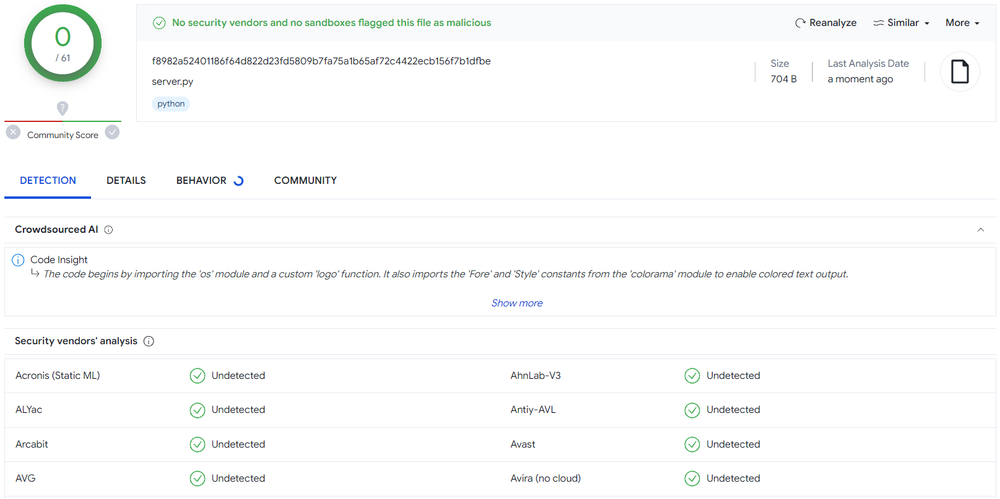

<html lang="en">
    <head>
        <meta charset="UTF-8">
        <meta name="viewport" content="width=device-width, initial-scale=1.0">
        <meta name="author" content="gsociety">
    </head>
    <body>
        <h1>AnonXploit</h1>
        

            
            
            
            
        

        <h4>AnonXploit is a tool for pentesters, it can be used by organizations of all sizes, including individuals.</h4>
        <h4>It was developed with the purpose of exploiting the vulnerability of creating a reverse shell between the pentester and the injected computer. This tool can work without warnings about viruses and suspicious connections.</h4>
         
        

            <h2>📋 Table of Contents</h2>
            
<a href="#supported_os">1. 💻 Compatible Operating Systems</a>

            
<a href="#installation">2. 🔨 Installation</a>

            
<a href="#how_to_use">3. 📡 How to Use</a>

            
<a href="#code_analysis">4. ☑️ Code Analysis</a>

            
<a href="#license">4. ©️ License</a>

        

         
        

            <h2>💻 Supported Operating Systems</h2>
            <td></td>
            <td colspan="2"></td>
            <h4>We carried out the tests on systems based on Ubuntu, Debian and Termux. We believe it will also work on other systems, such as Fedora and Arch. The installation instructions are for Ubuntu/Debian and Termux only. If you don't know how to install on other operation system, google it.</h4>
        

         
        

            <h2>🔨 Installation</h2>
            <h3>Installation for Debian/Ubuntu</h3>
            <h5>System Update</h5>
            <code>sudo apt update</code>
            <h5>Install Git</h5>
            <code>sudo apt install -y git</code>
            <h5>Download the Repository</h5>
            <code>git clone https://github.com/gsociety0/AnonXploit.git</code>
            <h5>Install AnonXploit</h5>
            <code>./install</code> or <code>bash ./install</code>
            <h3>Installation for Termux</h3>
            <h5>System Update</h5>
            <code>pkg update</code>
             
            <code>pkg full-upgrade -y</code>
            <h5>Install Git</h5>
            <code>pkg install -y git</code>
            <h5>Install Python3</h5>
            <code>pkg install -y python python-pip</code>
            <h5>Download the Repository</h5>
            <code>git clone https://github.com/gsociety0/AnonXploit.git</code>
            <h5>Install AnonXploit</h5>
            <code>./install</code> or <code>bash ./install</code>
        

         
        

            <h2>📡 How to Use</h2>
            <h4>To create the RAT you need to run two programs, client.py and server.py. Where the client will automatically create the RAT, and the server will wait for the connection.</h4>
            <h5>client.py</h5>
            <code>python3 client.py</code>
            <h5>server.py</h5>
            <code>python3 server.py</code>
        

         
        

            <h2>☑️ Code Analysis</h2>
            <h4>If you check the source code of each AnonXploit file, you will notice that the code is obfuscated. This is done for security reasons and compatibility with WSL (Windows Subsystem for Linux), where the antivirus detected the files as viruses and deleted them.</h4>
            <h3>🔬 Virus Total</h3>
            <h4>install file:</h4>
            
             
            <h4>client.py file (91% undetectable):</h4>
            
             
            <h4>server.py file:</h4>
            
             
             
            
<b>DON'T UPLOAD THE RAT FILE TO VIRUS TOTAL!</b>

            <h4>The RAT bypasses Windows Defender antivirus. <b>(Information verified until 1/28/2024)</b></h4>
            <h4>"Files and URLs sent to VirusTotal will be shared with antivirus vendors and security companies..."</h4>
            <h6>Source: <a href="https://en.wikipedia.org/wiki/VirusTotal">Wikipedia</a></h6>
        

             
            

            <h2>©️ License</h2>
            <h4>This project is licensed under the <a href="https://choosealicense.com/licenses/agpl-3.0/">GNU Affero General Public License v3.0</a></h4>
            <h4>✅ Permission:</h4>
            <li>Patent use;</li>
            <li>Commercial use;</li>
            <li>Private use;</li>
            <li>Distribution;</li>
            <li>Modification.</li>
            <h4>✒️ Conditions:</h4>
            <li>Same license;</li>
            <li>Disclose source;</li>
            <li>License and copyright notice;</li>
            <li>Network use is distribution;</li>
            <li>State changes.</li>
            <h4>⚠️ Limitations:</h4>
            <li>Liability;</li>
            <li>Warranty.</li>
        

    </body>
</html>
